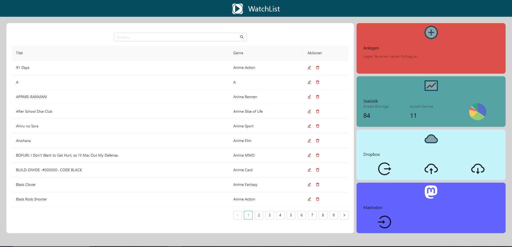
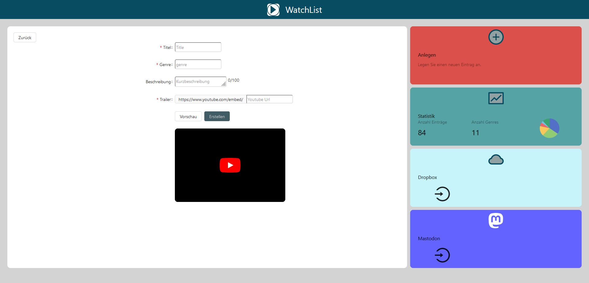
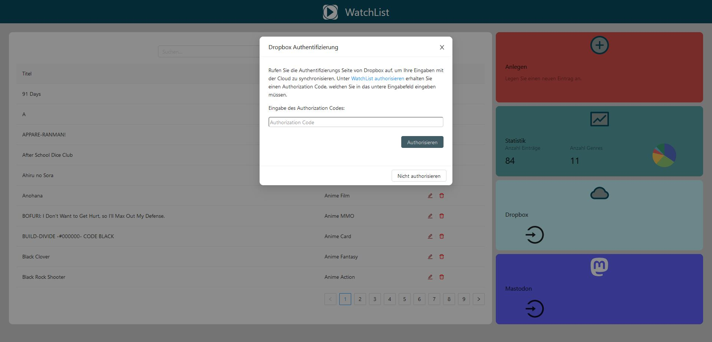
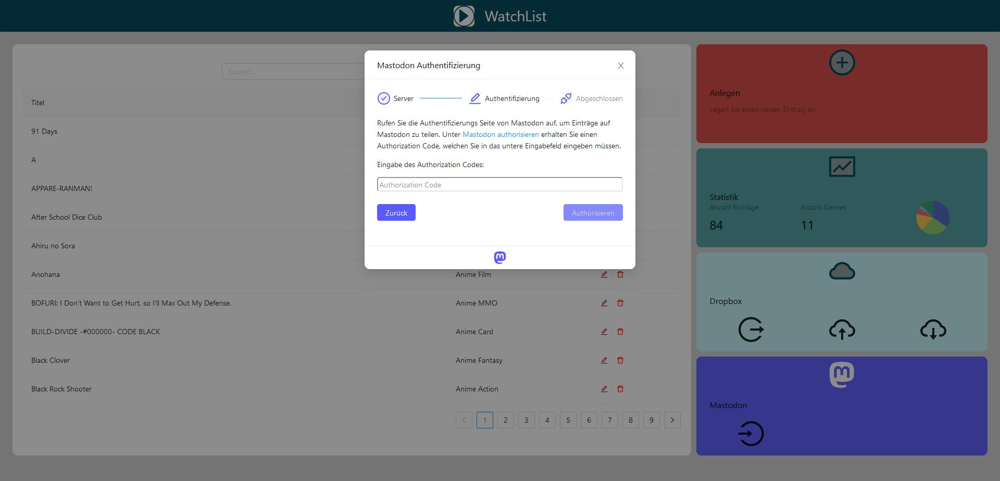
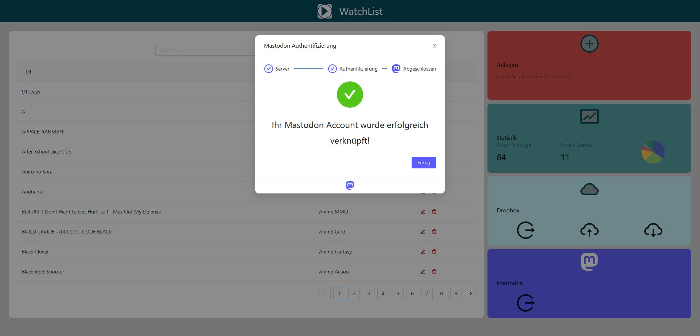
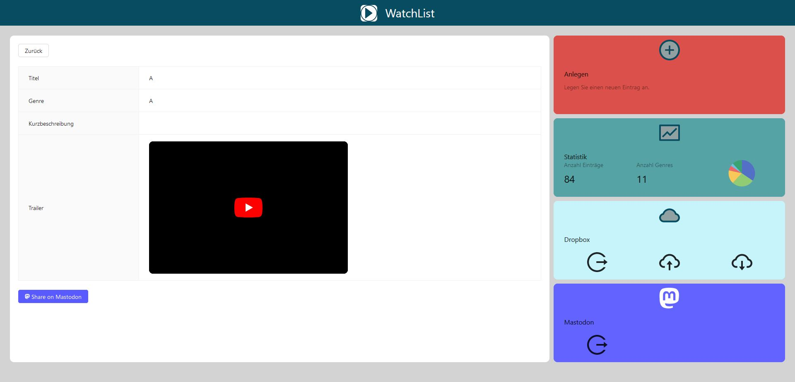
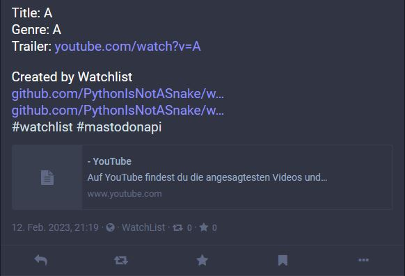

# WatchlistFrontend

# Deployment

## Configure app.config.json
Copy the file app.config.json.dist in /src/assets/ and rename the copy to app.config.json  
Fill each property to get all functions of watchlist.  
baseApi is the Url of your deployed watchlist service. Find the project on https://github.com/PythonIsNotASnake/watchlistService .  
dropboxUrl is the defined api of dropbox cloud service. This property must not be changed.  
dropboxClientId is the id of your dropbox application. You can build a new dropbox application on the dropbox website and can find your dropbox client id there.  
mastodonUrl is the defined api of mastodon. It is important to change the instance at the beginning of the url to the instance of your account.  
mastodonClientId  is the id of your mastodon application. You can build a new mastodon application on the mastodon website of your instance and can find your mastodon client id there.  
mastodonRedirectUri is the url to link the client after login on mastodon. If you don't want to get redirected don't change this property.  

## Apache Web Server
Install Apache Web Server with e.g. "sudo apt install apache2" on debian based systems (Debian, Ubuntu, Raspberry Pi OS etc.).  
Enable Apaches Rewrite Mode in Terminal with "sudo a2enmod rewrite"  
and restart Apache2 with "systemctl restart apache2"  
In project directory use following commands.  
To install all needed dependencies "sudo npm install -g @angular/cli"  
and "sudo npm install"  
To build project "npm run build" or "npm run build --prod"  
Extract builded files to /var/www/html
###Configure your Apache Web Server
#### /etc/apache2/apache2.conf
Add following code:
```
<Directory /var/www/html>
	Options Indexes FollowSymLinks
	AllowOverride All
	Require all granted
		
		RewriteEngine On
		RewriteBase /
		RewriteCond %{DOCUMENT_ROOT}%{REQUEST_URI} -f [OR]
		RewriteCond %{DOCUMENT_ROOT}%{REQUEST_URI} -d
		RewriteRule ^ - [L]
		RewriteRule ^ ./index.html
</Directory>
```
#### /var/www/html/.htaccess
Create .htaccess file with following content:
```
<IfModule mod_rewrite.c>

	RewriteEngine On
	RewriteBase /

	RewriteCond %{DOCUMENT_ROOT}%{REQUEST_URI} -f [OR]
	RewriteCond %{DOCUMENT_ROOT}%{REQUEST_URI} -d

	RewriteRule ^ - [L]
	RewriteRule ^ ./index.html

</IfModule>
```

## ARM Deployment (e.g. Raspberry PI)
In project directory use following commands.  
To install all needed dependencies "sudo npm install -g @angular/cli"  
and "sudo npm install"  
To build project "npm run build" or "npm run build --prod"  
To build docker image "docker build -t watchlistfrontend:latest ."  
To run docker container "docker run -d -it --name watchlistFrontend -p 4200:80 watchlistfrontend:latest"  
Congratulations! Your website can be reached on http://{ip-address}:4200/  
Hint: If you want to start the container on startup of your machine automatically insert the additional flag "--restart always" to the "docker run"-command.  
# Images  
    
  
    
    
  
This project was generated with [Angular CLI](https://github.com/angular/angular-cli) version 13.3.5.
